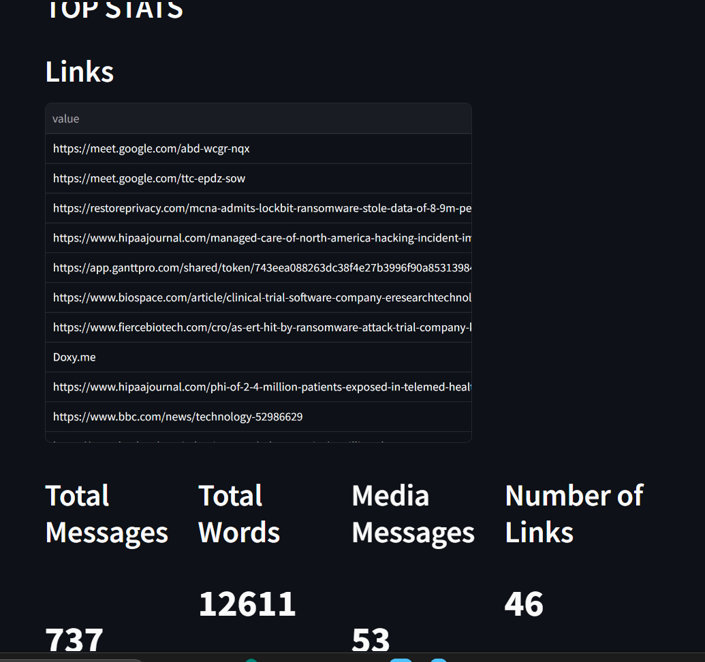
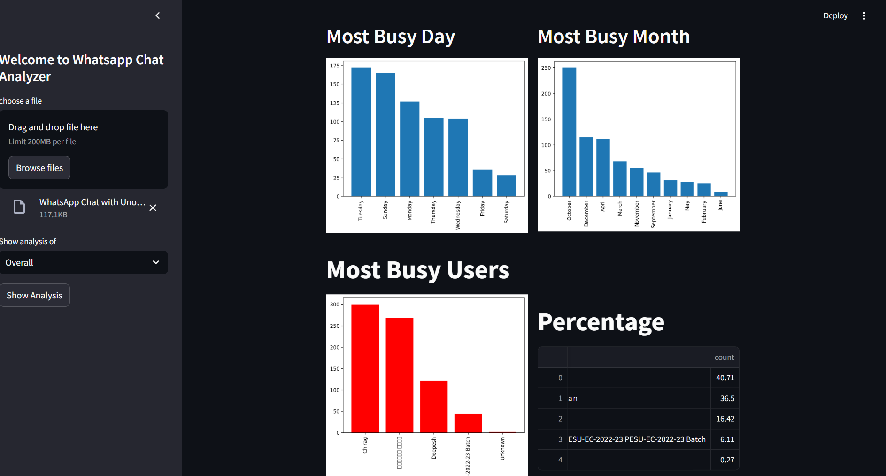

# 📊 WhatsApp Chat Analyzer
A **Streamlit-based web app** to analyze WhatsApp chat data and visualize user engagement, activity trends, and emoji usage.

---

## 🚀 Project Overview
This project allows users to upload their **WhatsApp chat exports** and provides:
- 📈 Statistical summaries
- 🗓 Timeline visualizations
- ☁️ Word cloud generation
- 😂 Emoji analysis
- 🧑‍🤝‍🧑 User activity insights

It’s a quick and interactive way to understand chat behaviors in individual or group conversations.

---

## 🔧 Tech Stack
- **Frontend:** Streamlit (Python Web Framework)
- **Backend:** Python
- **Libraries Used:**
  - `pandas` – Data manipulation
  - `matplotlib` – Data visualization
  - `wordcloud` – Word cloud generation
  - `emoji` – Emoji processing
  - `urlextract` – URL extraction from messages

---

## ✨ Features
- 📈 **Chat Statistics:** Total messages, word count, shared links, and media messages.
- 🗓 **Monthly & Daily Timelines:** Visual representation of chat activity trends.
- 🗂 **Activity Maps:** Most active days and months.
- 🧑‍🤝‍🧑 **User Activity:** Busiest user analysis in group chats.
- ☁️ **Word Cloud:** Most commonly used words visualized.
- 😂 **Emoji Analysis:** Detailed emoji usage breakdown.
- 🔗 **Link Extraction:** Displays all shared URLs in the chat.

---

## 📂 Project Structure

WHATSAPP_CHAT_ANALYZER/
├── app.py              # Main Streamlit App
├── helper.py           # Chat analysis functions
├── preprocessor.py     # Chat preprocessing functions
├── requirements.txt    # Required packages
├── .gitignore          # Git ignore file
├── README.md           # Project documentation
└── images/             # Screenshots
---
```text

## 🖼️ Screenshots
Dashboard View


Stats




```
## 🛠️ How to Run Locally
1. Clone the Repository:
bash
Copy
Edit
git clone https://github.com/YOUR_USERNAME/YOUR_REPO_NAME.git
cd YOUR_REPO_NAME
2. Install the Required Packages:
bash
Copy
Edit
pip install -r requirements.txt
3. Run the Streamlit App:
bash
Copy
Edit
streamlit run app.py
## ⚙️ Requirements
Here’s what you need to install:

bash
Copy
Edit
streamlit
matplotlib
pandas
wordcloud
emoji
urlextract
(You can put these in a requirements.txt file.)

📬 Connect with Me
🔗 LinkedIn Profile

📧 Email: chiru7975@gmail.com

💻 GitHub Profile

📄 License
This project is open-source and free to use.
```text
